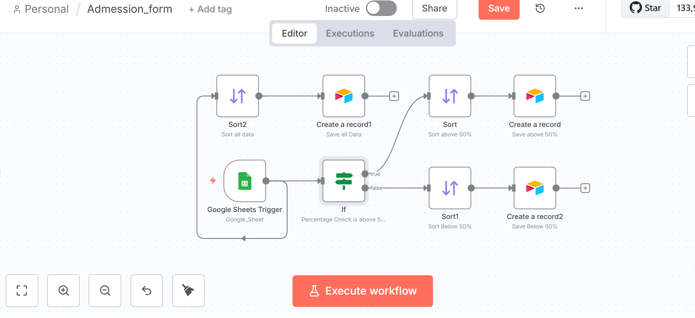
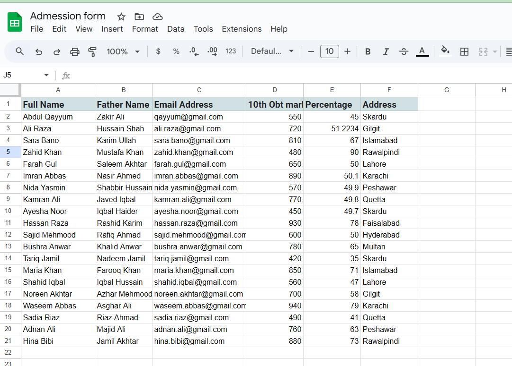
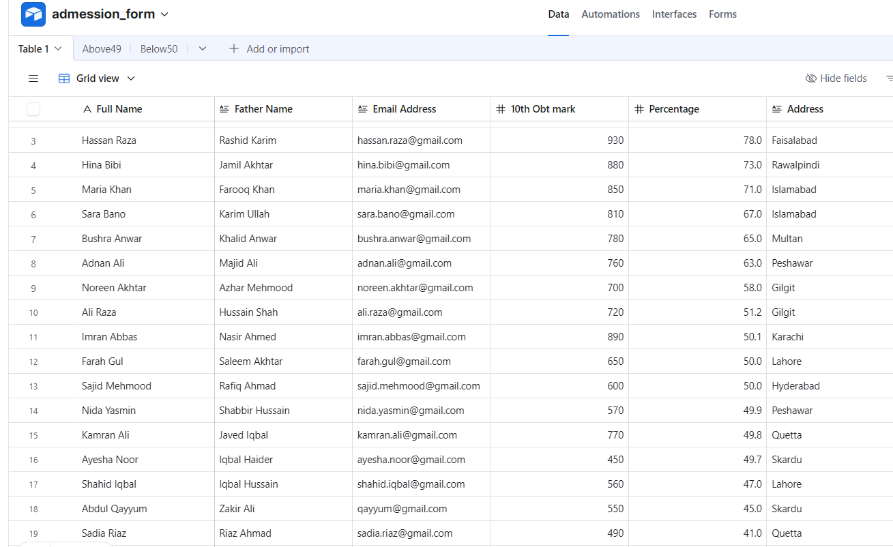
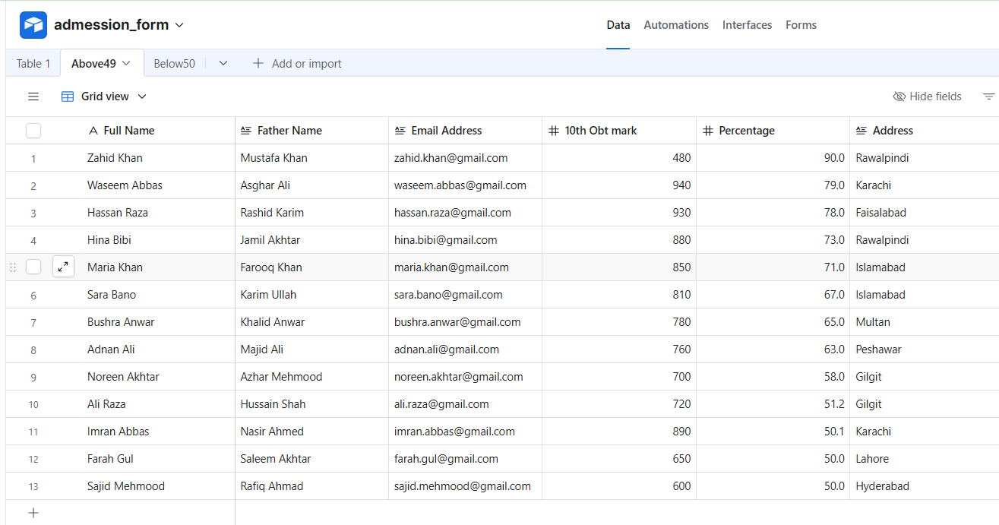
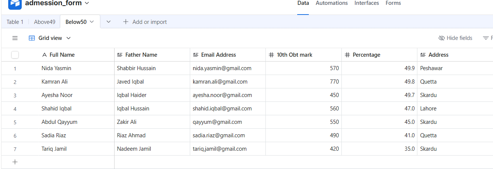

# n8n Workflow Portfolio

This repository contains a collection of my automation projects built with n8n. Each project demonstrates my ability to design, develop, and deploy efficient workflows that solve real-world problems.

---

## Projects

### 1. Automated Student Admission Workflow

* **Workflow Name:** `Admession_form.json
* **Problem:** Colleges and schools need an efficient way to filter student applications from a Google Sheet based on their academic performance, specifically to identify those who qualify for a written admission test.
* **Solution:** This workflow automates the entire process. It reads student data from a Google Sheet, applies a conditional check to sort applicants based on their percentage (above or below 50%), and automatically stores the categorized records in separate Airtable tables. This saves significant time and eliminates manual errors in the admissions process.
* **Skills Demonstrated:**
    * Workflow design and automation
    * Google Sheets integration
    * Airtable integration
    * Conditional logic (`If` nodes)
    * Data sorting and manipulation

---

## How to Use These Workflows

1.  **Clone the repository:** (https://github.com/s9shigri-png/n8n_worklow)`
2.  **Open n8n:** Import the desired `.json` workflow file from the repository into your n8n instance.
3.  **Configure Credentials:** Update the credentials for Google Sheets and Airtable with your own API keys.
4.  **Run:** Execute the workflow to see the automation in action.

---
## Images
1. 
2. 
3. 
4. 
5. 

## Contact
Feel free to connect with me to discuss these projects or other automation solutions.
